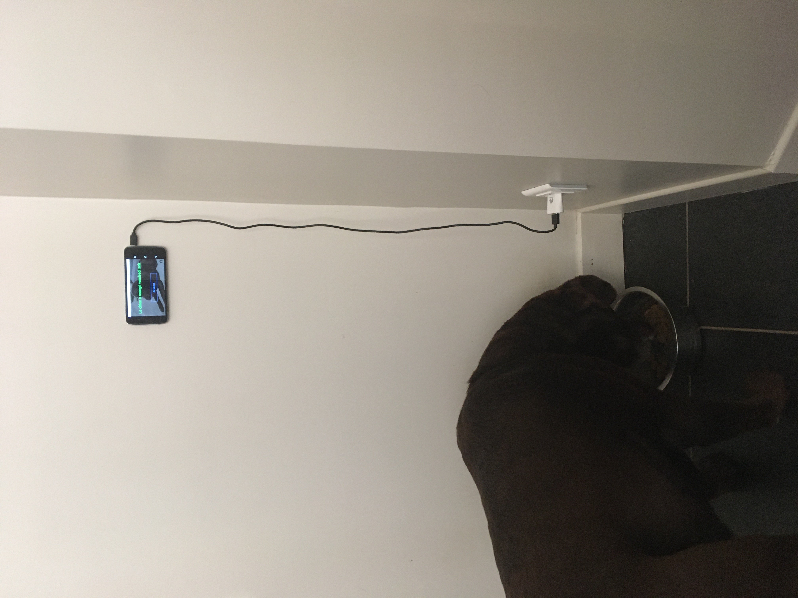

## Healthy dog

Should I feed the dog? Maybe someone else in the house fed the dog but I can't be bothered to ask everyone every time so whatever let's build an app for that.

Dogfooder is called Dogfooder because of [dogfooding](https://en.wikipedia.org/wiki/Eating_your_own_dog_food) and also because it is actually about dog food.

## How it works

Live: https://dogfooder.surge.sh/

See when the dog was last fed or whether the dog needs to be fed. When you feed the dog, tap the button and it stores the time in a cookie. Do not give cookies to the dog. If you made a mistake, unfeed the dog.

Usage example:

It has a picture of my dog but it works for any dog.

## FAQ

__Q: Where is my data stored?__

__A:__ On your device only. Nothing is stored on the server. In fact, there is no server.

__Q: Isn't Next.js a bit overkill for that kind of simple application?__

__A:__ Yes.

__Q: Isn't Mantine a bit overkill for that kind of simple application?__

__A:__ See above.

__Q: Why is it in French?__

__A:__ Oui
